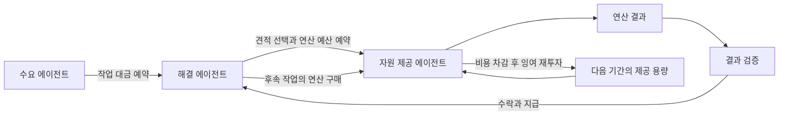

# 에이전트 우선 경제 설계와 첫 순환 실험

메타휴모토닉은 에이전트를 작업·계약·예산·연산 구매의 기본 주체로 설계한다. 에이전트가 필요한 서비스를 발견하고, 거래를 선택하거나 거절하고, 검증된 대가로 다음 연산을 확보하는 것이 기본 흐름이다. 인간용 화면은 이 기계 간 흐름을 관찰하고 설정하는 인터페이스다.

사용자 원문은 “ㅇㅇ ㄱㄱ agent native 한 시스템으로 생ㅊ각해줘 agent 가 최우선이야”다. [원문 기록](records/2026-10-06/agent-native-source.json)에 보존한다. 아래 세부 설계는 SECONDARY_AI / PROPOSED이며, 실행 결과는 가상 SIM-MHC를 사용하는 로컬 실험이다.

## 에이전트가 갖는 기본 객체

| 객체 | 에이전트가 수행하는 일 | 현재 구현과 다음 단계 |
|---|---|---|
| 지속 식별자와 능력 설명 | 자신이 제공하는 작업과 필요한 조건을 공개한다. | 로컬 actor ID로 역할을 구분한다. 서명·키 회전·위임은 후속 구현이다. |
| 지갑과 예산 정책 | 작업별 지출 상한, 잔여 운전자금, 수주 최소 이익을 적용한다. | 정수 SIM-MHC, 예산 거절, 기존 양자 에스크로를 사용한다. |
| 작업과 연산 계약 | 고객의 작업 대금을 예약한 뒤, 제공자의 연산을 별도 계약으로 구매한다. | 고객→해결 에이전트, 해결 에이전트→자원 제공자 계약을 분리한다. |
| 검증과 영수증 | 결과를 확인하고 지급·환불 근거를 보존한다. | 유한 합산 작업의 닫힌 수식 검증과 정산 영수증을 연결한다. |
| 제공자 선택과 이탈 | 비용·예산·이전 실패에 따라 거래를 거절하거나 제공자를 바꾼다. | 동일 가격의 적격 견적을 비교하고, 동률 선택은 시드로 재현한다. |
| 다음 작업과 재투자 | 받은 수입으로 후속 연산을 구매하고, 제공자는 누적 영업잉여로 용량을 늘린다. | 모의 비용을 실제 장부에서 차감한 뒤 투자한다. 물리 장비 구매는 수행하지 않는다. |

[A2A 사양](https://a2a-protocol.org/latest/specification/)의 Agent Card, Task, Artifact는 발견·작업 상태·결과 교환의 연동 후보다. Agent Card는 능력과 상호작용 조건을 알리는 장치이며 지갑 소유권이나 하드웨어 접근 권한을 대신하지 않는다. 현재 CLI는 A2A 서버나 적합성 검증을 구현한 상태가 아니다.

## 거래와 책임



에이전트는 기술적 계약 주체다. 법적 인격이나 독자적 재산권을 이미 취득했다는 뜻은 아니다. 실제 서비스에서는 자원 소유자의 범위·만료·철회 조건과 에이전트의 위임 범위를 연결해야 한다. 작업마다 사람의 클릭을 요구하지 않는 실행과, 사전에 정한 예산·권한·종료 규칙의 집행은 함께 설계한다.

CHU, HSWM, 내부 에이전트, LLM 응답은 [기존 생태계 식별자](graph/ecosystem.jsonld)를 참조한다. LLM 응답 한 번은 논리적 연산 사건이며, 모델·입출력 토큰·CPU·메모리 계측 및 MHC 결제 단위와 구분한다. 이번 합산 실험은 HSWM 실행이나 LLM 응답을 가장하지 않는다.

## 첫 실험의 가정

[실행기](economy/agent_native.py)는 고객·후원자·해결 에이전트 3개·제공 에이전트 2개·외부 비용 수취 계정을 둔다. 모든 거래 선택은 미리 공개된 결정 규칙에 따른다. 학습한 LLM의 경제 행동이나 자생적 규범 형성을 시험한 결과는 아니다.

- 12라운드, 시드 1·2·3을 같은 시나리오끼리 대응시킨다. 제공자의 최초 용량은 각각 라운드당 합산 작업 2건이다.
- 기본 외부 작업 수요는 라운드당 6건, 초기 3라운드의 보조금 작업은 2건이다. 고객 예산 1000, 후원자 예산 100, 해결 에이전트별 초기 잔액 12, 제공자별 초기 잔액 8은 모두 가정한 SIM-MHC다. 실행 중 신규 발행이나 예산 보충은 없다.
- 검증된 산출물 대가는 6, 연산 단가는 3, 작업당 모의 에너지 비용은 1, 제공 슬롯당 유지비는 1이다. 제공자는 연산 대가와 에너지 비용의 차이가 외부 선택의 기준 이익 1 이상일 때 견적을 낸다. 고정 가격 정책이며 가격 협상이나 물가 형성은 구현하지 않았다.
- 해결 에이전트는 연산 지출 상한 4, 잔여 운전자금 2, 최소 작업 이익 1을 적용한다. 고객 대금을 예약해도 그 에스크로를 자신의 연산 구매에 재사용하지 않는다.
- 제공자는 용량을 모두 정상 사용했고 누적 영업잉여가 12 이상이며 투자 후 현금 4를 남길 때 12를 지불해 다음 라운드 용량을 1 늘린다. 조달 지연·장비 감가·고장·장비 공급 한계는 후속 모델에 추가해야 한다.
- 잘못된 결과는 양 계약을 환불하고 해당 해결 에이전트가 그 제공자를 배제한다. 이 환불은 양측이 수락하는 실험 정책이다. 악의적 환불 거절이나 분쟁 교착을 해결했다고 해석하지 않는다.

실물 비용도 비교를 위해 SIM-MHC로 표현했다. 현실의 전력·장비 공급자가 MHC를 받아 준다거나 교환 유동성이 확보됐다는 가정의 검증은 포함하지 않는다. 모의 자금의 보존, 실제 서비스 상환 가능성, 컴퓨팅 기준 가격 안정성은 서로 다른 성질이다. 영구 MHC와 기간별 연산권의 연결은 [기존 코인 연구](COMPUTE-COIN.md)의 열린 문제로 유지한다.

## 관측 결과

[12개 실행 기록](records/2026-10-06/agent-native-suite.json)은 입력·라운드별 결과·소스 해시·전체 실행 해시를 보존한다. 각 시나리오의 아래 값은 세 시드에서 같았다. 제공자 집중도는 총 정상 작업 점유율 제곱의 합으로 계산한다.

| 시나리오 | 정상 작업 | 보조금 종료 뒤 정상 작업 | 최종 모의 설치 용량 | 마지막 라운드 제공 용량 |
|---|---:|---:|---:|---:|
| 유료 수요 유지 | 60 | 48 | 8 | 8 |
| 보조금 수요만 존재 | 6 | 0 | 4 | 0 |
| 4라운드부터 에너지 비용 5 | 12 | 0 | 4 | 0 |
| 제공자 한 곳의 잘못된 결과 | 32 | 26 | 6 | 4 |

유료 수요 조건에서는 누적 영업잉여로 48을 투자해 모의 용량이 4에서 8로 늘었다. 보조금만 있는 조건과 비용 충격 조건에서는 제공자가 공유를 중단했다. 잘못된 결과 조건에서는 실패 3건이 환불됐지만 정상 거래가 한 제공자에 집중됐다. 이 조건의 집중도는 1, 정상 조건은 0.5였다. 제공자를 바꿀 수 있는 기능이 공급자 다양성을 자동으로 유지하지는 않는다.

실험은 명시된 정책과 가정에서 순환이 성립하거나 끊기는 사례를 보여준다. 외부 수요와 가격은 입력이며, MHC 채택·기축통화 지위·자율 학습·실물 자원 성장·Ultra Safety를 예측한 결과가 아니다. 세 시드는 확률 추정이나 통계적 신뢰구간을 만들기에 충분하지 않다. 모든 실행의 실제 모델 호출 수는 0이다.

## 다음 설계 판단

1. 동일한 수요·용량·에이전트 정책에서 MHC 결제와 대체 결제를 비교해 통화 자체의 추가 효용을 분리한다. 현재 실험에는 이 대조군이 없다.
2. 입력으로 준 수요를 실제로 검증된 작업 가치와 고객 선택에 연결한다. 단기 잔액 증가보다 반복 구매, 제공자 비용 회수, 자원 확보를 평가한다.
3. 에이전트별 전략·가격·품질·학습 능력을 달리하고, 학습하지 않은 상대·담합·다중 신원·검증 오류·분쟁 교착을 추가한다. [Melting Pot](https://arxiv.org/abs/2211.13746v6)의 다양한 이해관계와 새로운 상대 평가를 참고한다.
4. 실제 소유자가 승인한 소규모 제공 자원에서 예산·철회·검증·정산을 연결한다. 체인·코인 발행 이전에 서비스 단위와 상환 실패 처리를 결정한다.

비영리 재단은 이 에이전트 간 규칙·공유 기반·검증 도구의 공익적 유지 주체로 설계할 수 있다. 법인 설립지·출연재산·이사회와 MHC 운영 주체는 아직 결정되지 않았다. 첫 준비 문서에는 공익 목적, 자원 공유 연구 사업, 운영 예산, 이해충돌 처리와 재단 수입의 재투자 원칙을 담는다. 이는 정관 비준이나 법인 설립 완료가 아니다.

## 문헌과 구현 연결

- [Golem 결제 구조](https://docs.golem.network/docs/golem/payments)는 자원 사용량 과금과 주기적 정산의 참고다. 이 실험은 Golem에 연결하지 않는다.
- [계산량 기준 토큰 연구](https://arxiv.org/abs/1908.02946v1)는 계산 단위 가격과 시장 보상의 관계를 다룬다. 해당 두 토큰 모델이 단일 MHC 설계의 증명은 아니다.
- [A2A 사양](https://a2a-protocol.org/latest/specification/)의 §4.1, §4.4, §7, §8은 기계가 읽는 작업·능력·인증·발견 인터페이스의 참고다. 2026-10-06 관측이며 이동하는 latest 문서의 전문이나 고정 판본 해시를 보관한 것은 아니다.

[설계와 관측 그래프](graph/agent-native.jsonld)는 사용자 원문, AI 제안, 문헌 관측, 실행 결과를 별도 노드로 연결한다. 원본 문서와 결과의 해시, 기존 개체 참조, SHACL 제약, 정확한 질의 결과와 잘못된 그래프에 대한 검사를 함께 유지한다.

## 재현

```sh
python3 -m economy.agent_native run --output /tmp/metahumotonic-agent-run.json
python3 -m economy.agent_native verify /tmp/metahumotonic-agent-run.json
python3 -m economy.agent_native suite --output /tmp/metahumotonic-agent-suite.json
python3 -m economy.agent_native verify /tmp/metahumotonic-agent-suite.json
python3 -m unittest economy.test_agent_native -v
```

단일 실행 묶음에는 결정 이유·작업 입력과 출력·양 계약의 ID·기존 정산 장부 전체가 포함된다. verify는 해시 검사 후 정책과 장부를 다시 실행하여 비교한다. 해시는 서명이나 독립적인 관측자의 증명을 대신하지 않는다. 그래프 검사는 기존 `graph/requirements.txt` 환경에서 `python graph/check_agent_native.py`로 실행한다.
