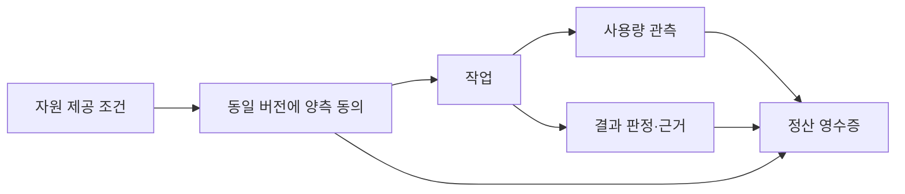

# MetaHumoCoin — 자유의 기반에서 경제의 설계로

> CONSIDERATION · G0 설계/근거 그래프 · 규범 효력 없음 · 2026-10-02

이 문서는 [economy.jsonld](graph/economy.jsonld)에서 생성한다. 사용자 원문, 외부 공식 문서에 대한 관측, AI의 적용 제안을 각각 구분한다. `python graph/check.py --write-view`로 갱신한다.

## 철학과 직접 출처

하드웨어와 접근 권한의 공유, USL/P2P 연결, CHU·HSWM 안의 자유·경제·합의가 기존 정신의 맥락이다. 이번 사용자는 그 기반으로 자유가 충족되며 경제에는 MetaHumoCoin이 필요하다고 덧붙였다. 기존 P3의 전체 권한 공유 주장은 그대로 참조하며, 과거 AI 검토안 R3를 사용자에게 채택된 뜻으로 바꾸지 않는다.

> 핵심도 하나 더있어 자유는 그렇게 충족되고 그 경제를 어케할건가에 있어서 metahumocoin 이 있어야한다고봐

— 사용자, 2026-10-01 (`eco:u_coin`; 원문 UTF-8 SHA-256을 검사한다).

- **eco:C_freedom**: 제안자는 자유가 그렇게 충족된다고 본다. 원문 구간: “자유는 그렇게 충족되고”.
- **eco:C_coin**: 제안자는 그 경제를 어떻게 구현할 것인가에 대해 MetaHumoCoin이 필요하다고 본다. 원문 구간: “그 경제를 어케할건가에 있어서 metahumocoin 이 있어야한다고봐”.

화폐 개념 `eco:metahumocoin`과 이를 실현할 실제 구현 프로젝트 `mhc:project`를 구별한다. 사용자가 명확히 한 실제 코인 구현 목표, 원장·발행·지갑·정산 설계와 테스트넷/메인넷 작업은 [METAHUMOCOIN.md](METAHUMOCOIN.md)에 연결했다. 아래 경제 비교와 시뮬레이터는 그 구현의 보조 자료다. 특정 체인·공급량·분배 규칙은 아직 결정하지 않았다.

## 외부 구현체에서 참고한 구조

2026-10-02 공식 문서와 구현 저장소를 확인했다. `DOCUMENTED`는 문서를 읽었다는 상태이고, 로컬 연동이나 성능 검증 상태가 아니다. 아래 적용은 모두 AI 설계 후보다.

| 구현·메커니즘 | 확인한 내용 | 적용 범위의 한계 | 근거 |
|---|---|---|---|
| [Golem: 예산·양자 협상·청구](https://github.com/golemfactory/yagna) | Requestor의 예산 allocation과 demand/offer 협상이 agreement로 이어지고, provider가 활동별 debit note와 invoice를 보낸다. | 공급자 청구와 지불 처리는 작업 결과의 보편적 정확성을 증명하지 않는다. | [Golem requestor–provider interactions](https://docs.golem.network/docs/creators/common/requestor-provider-interaction) |
| [Golem: 공급자 관측 지표](https://github.com/golemfactory/yagna) | 평판 시스템은 벤치마크와 가용성 등 공급자 관측을 제공한다. 문서는 현재 평판 시스템이 수행한 작업을 추적한다고 설명한다. | 평판은 관측 범위에 제한된다. 모든 과거 작업의 진실성이나 코인 발행 근거로 승격하지 않는다. | [Golem reputation system](https://docs.golem.network/docs/reputation) |
| [Akash: lease·escrow](https://github.com/akash-network/node) | 요청·입찰 뒤 선택한 공급자와 lease가 생성되고 escrow가 임대 비용 정산을 다룬다. 체인의 합의·거버넌스와 워크로드 임대는 별도 기능이다. | 임대/결제 기록은 워크로드 결과 검증과 다르다. AKT/ACT 구조나 통화 정책은 MetaHumoCoin에 자동 이전하지 않는다. | [Akash providers and leases](https://akash.network/docs/learn/core-concepts/providers-leases/) · [Akash application layer](https://akash.network/docs/node-operators/architecture/application-layer/) |
| [x402: 결제 요구·검증·정산](https://github.com/x402-foundation/x402) | 서버가 결제 요구를 제시하고 클라이언트가 payment payload를 제출한다. verify와 settle을 구분하며 facilitator를 이용할 수 있다. 예산 관리와 세션 관리는 핵심 규격 범위 밖이다. | MetaHumoCoin의 발행, 자원 배치, 작업 검증을 제공하지 않는다. 실제 연동에는 asset/network/scheme 및 adapter 지원 확인이 필요하다. | [x402 specification v2](https://github.com/x402-foundation/x402/blob/e187dda1ef0c69c85416625342e5bb7c4b857dac/specs/x402-specification-v2.md) |

구현 저장소의 관측 커밋: [Golem / Yagna `c256fce6`](https://github.com/golemfactory/yagna/tree/c256fce68c50c141a51d4bd2ca18292e4b006f15) · [Akash node `9962f09d`](https://github.com/akash-network/node/tree/9962f09d65b6dad4676f1b34be823dd8ca129dde) · [x402 `6b6ee91f`](https://github.com/x402-foundation/x402/tree/6b6ee91fee027b540faabcb25774e73851006c3b).

x402 규격은 커밋을 고정했다. Golem·Akash 문서는 버전 없는 웹 문서여서 관측일을 기록하며, 이후 변경 가능성이 있다. 구현 커밋은 소스 위치를 식별한 것이며, 기능 설명은 공식 문서에 근거한다. 이 비교는 코드 라이선스 검토나 통합 시험을 대신하지 않는다.

## 메타휴모토닉에 적용한 설계 후보

### eco:D_resource — 공유 기반과 거래 계약의 연결

USL/P2P로 식별한 공유 자원 위에서 요청·제공 조건을 교환하고, 거래할 때 양 당사자가 같은 agreement 버전을 수락하도록 모델링한다.

기존 P3 원문을 다른 참여 조건으로 대체하지 않는다. 거래 계약은 기술 설계 후보이며 접근 권한을 발급하는 행위가 아니다.

근거 명제: `sp:P2`, `sp:P3`, `sp:P4`, `sp:P6`, `eco:C_freedom`. 참고 메커니즘: `eco:M_golem`.

### eco:D_accounting — 관측에 근거한 정산과 예산

작업·계량 관측·결과 수락·청구·정산 영수증을 별도 노드로 연결한다. 필요하면 lease/escrow 패턴으로 예산과 지급 시점을 명시한다.

계량 관측과 공급자 평판은 검증 대상이다. 결제 확인은 결과 정확성의 증명이 아니며 기여 대가 지급과 새 화폐 발행도 다른 사건이다.

근거 명제: `eco:C_coin`, `sp:P6`. 참고 메커니즘: `eco:M_golem`, `eco:M_reputation`, `eco:M_akash`.

### eco:D_api — agent 서비스 결제 adapter 후보

agent/API 서비스에는 x402의 결제 요구·verify·settle 분리를 adapter 경계로 참고한다. MetaHumoCoin을 사용하려면 선택할 자산·원장·scheme에 맞는 구현이 필요하다.

x402 적용이나 MetaHumoCoin 지원은 아직 구현·시험되지 않았다. 기존 토큰으로 MetaHumoCoin의 정체성을 대체하지 않는다.

근거 명제: `eco:C_coin`. 참고 메커니즘: `eco:M_x402`.

### eco:D_consensus — 세 가지 합의를 분리

거래 조건에 대한 당사자 동의, 공동체의 규칙 결정, 원장의 기록 확정을 각기 다른 대상과 절차로 표현한다.

블록체인 합의 또는 토큰 보유량만으로 메타휴모토닉의 합의 철학이 구현되었다고 판정하지 않는다.

근거 명제: `sp:P6`, `eco:C_coin`. 참고 메커니즘: `eco:M_akash`, `eco:M_x402`.

### eco:D_simulation — 결정론적 로컬 경제 시뮬레이터

동일 조건에 대한 양측 동의, 예산 예약, 작업 보고와 수락, 정산, 실행 전 취소, 양측 합의에 의한 분쟁 정산을 로컬에서 실행한다. 잔액 보존과 재요청 시 중복 지급 방지, 이벤트 재현과 그래프 출력을 검사한다.

정산 규칙을 시험하는 보조 구현이다. 실제 MetaHumoCoin 구현 목표의 완료 조건이 아니다. 실험 잔액·예시 가격·소수 정밀도는 발행·분배·체인 정책으로 승격하지 않는다.

근거 명제: `eco:C_coin`, `sp:P6`. 참고 메커니즘: `eco:M_golem`, `eco:M_akash`.

## 검증 가능한 가상 거래 예제

[거래 예제](graph/fixtures/economy-flow.jsonld)는 아래 관계를 가진다. 예제의 모든 실행·거래 노드는 `SIMULATED`다. 예제 통화는 MetaHumoCoin 구상을 참조하는 가상 표시 단위이고, 실제 코인을 발행하거나 전송하지 않는다.



가상 사용량 3 × 합의한 가상 단가 2 = 정산 6을 `Decimal`로 검사한다. 당사자 동의, 결과 수락, 정산 연결과 중복 청구도 확인한다. 이 정적 예제는 한 작업을 한 번 전액 정산한 형태다. 실행 가능한 상태 전이와 취소·분쟁 정산은 아래 로컬 시뮬레이터에서 확장한다. SHACL 통과는 그래프 일관성만 뜻하며 실제 작업의 정확성이나 경제 성립을 증명하지 않는다.

## 실행 가능한 로컬 경제 시뮬레이터

[실행 방법과 실험 정책](economy/README.md) · [시뮬레이터](economy/simulator.py) · [상태 전이 그래프 제약](graph/economy-simulation.shapes.ttl). `eco:D_simulation`의 SECONDARY_AI/PROPOSED 구현이다.

`python3 -m economy demo --output-dir /tmp/metahumotonic-economy-demo`로 정상 정산·실행 전 취소·양측 합의에 의한 분쟁 정산을 재현한다. 데모의 총 가상 잔액 100은 최종 90·10·0으로 보존되고 예약 잔액은 0이다. 정산 재요청은 중복 지급 없이 같은 영수증을 반환한다.

실행 결과에는 초기 입력, 명령 목록, 최종 상태, 해시 체인 이벤트와 소스 파일 해시가 들어간다. `python3 -m economy verify /tmp/metahumotonic-economy-demo/simulation.json`은 같은 명령을 다시 실행해 상태와 이벤트의 일치를 확인한다. JSON-LD 실행 기록은 사용자 원문까지 이어지는 설계 제안 참조를 가진다. 이 기록은 실험용 거래이고 실제 서명·원장 결제·작업 수행을 증명하지 않는다.

## 아직 결정하지 않은 정책

- **eco:Q_currency**: MetaHumoCoin을 어떤 화폐·원장으로 구현할 것인가? 체인, 단위, 정밀도, 자산 식별자와 외부 adapter 지원은 미정이다.
- **eco:Q_issuance**: 누가 어떤 근거로 최초 배분·추가 발행·회수 규칙을 정하는가? 하드웨어 공유·검증된 작업·사용량과 발행의 관계는 미정이다.
- **eco:Q_pricing**: 공유 기반 위에서 어떤 거래에 가격을 붙이고 누가 단가·예산·수수료를 합의하는가? 모든 공유 자원을 유료화한다는 전제는 없다.
- **eco:Q_evidence**: 기여·사용량·결과를 누가 어떻게 검증하고 허위 신고·중복 청구·Sybil을 어떻게 다루는가?
- **eco:Q_dispute**: 중단·취소·이의 제기·환불 때 미정산 작업과 이미 확정된 지급을 어떻게 처리하는가?
- **eco:Q_governance**: 거래 동의·공동체 규칙 결정·원장 합의를 어떤 절차로 연결하는가? 코인 보유량과 의사결정 권한의 관계는 미정이다.
- **eco:Q_charter**: 암호자산 또는 자원 제공 대가를 실제 도입·약속하는 안으로 구체화할 경우 CHARTER §8과 어떤 개정 절차로 정합성을 맞출 것인가? 현재 사용자 발언은 발행·지급 약속 자체가 아니다.

헌장·참여 약정은 이 작업으로 개정하지 않는다. `Q_charter`는 실제 도입 범위와 현재 규범의 정합성을 판단할 연결점이다. 현재 비약속은 연구·구현 자체의 금지로 확대하지 않는다. 구체적인 구현 결정은 [실제 코인 엔지니어링 그래프](METAHUMOCOIN.md)에서 추적한다. 기존 AI의 암호화폐 요약 P8이나 검토 판정 X11을 새 사용자 발언의 뜻으로 상속하지 않는다.

## 그래프 계약과 재현

- **형식:** [JSON-LD 1.1](https://www.w3.org/TR/json-ld11/)의 RDF 직렬화, [PROV-O](https://www.w3.org/TR/prov-o/)의 출처·작성자·작성 활동, [SHACL](https://www.w3.org/TR/shacl/) 제약, [SPARQL 1.1](https://www.w3.org/TR/sparql11-query/) 역량 질문.
- **소유·범위:** 이 저장소의 로컬 G0 설계. 공유 KG 게시·실행 그래프·서비스 배포를 의미하지 않는다. 새 IRI는 이 저장소의 `graph/economy#` 범위를 쓰고 기존 `sp:` IRI는 재사용한다.
- **계약:** [설계 어휘](graph/economy-vocab.ttl)·[설계 shapes](graph/economy.shapes.ttl), [거래 어휘](graph/economy-flow-vocab.ttl)·[거래 shapes](graph/economy-flow.shapes.ttl). 방향·domain/range·카디널리티를 명시한다.
- **출처 분리:** `Claim → Utterance`, `DesignProposal → basedOn Claim / borrowsFrom DocumentedMechanism → SourceDocument`. 사용자 원문으로 돌아갈 수 있고 AI 제안의 귀속을 자동으로 승격하지 않는다.
- **기존 자료:** `spirit.jsonld`의 기존 바이트·UID·원문은 보존한다. 기존 SPIRIT/YAML과 JSON-LD 간 전체 동기화는 이번 확장의 범위 밖이며, 이 문서는 경제 확장만의 생성 뷰다.

```sh
python3 -m venv /tmp/metahumotonic-graph-venv
/tmp/metahumotonic-graph-venv/bin/pip install -r graph/requirements.txt
python3 -m unittest discover -s economy -t .
/tmp/metahumotonic-graph-venv/bin/python graph/check.py
/tmp/metahumotonic-graph-venv/bin/python records/2026-09-29/check.py
```

검사기는 UID/JSON 키 중복, 등록된 술어·타입, 단절된 참조, domain/range, 원문·입력 파일 해시, SHACL 양성·음성 사례, 역량 질문과 이 문서의 생성 결과 일치를 확인한다. 네트워크에 접속하지 않는다. 외부 문서가 여전히 같은 내용인지, 실제 자원 권한·경제 동작이 유효한지는 별도 검증이다.

역량 질문은 코인과 자유의 직접 출처, 외부 구현→설계 연결, 미결정 통화 정책, AI 제안의 작성자, 세 합의의 구분, 규범 효력 여부, 정산의 계약·사용량·결과 근거, 예제 통화의 참조를 정확한 주체·출처 조합으로 검사한다.
