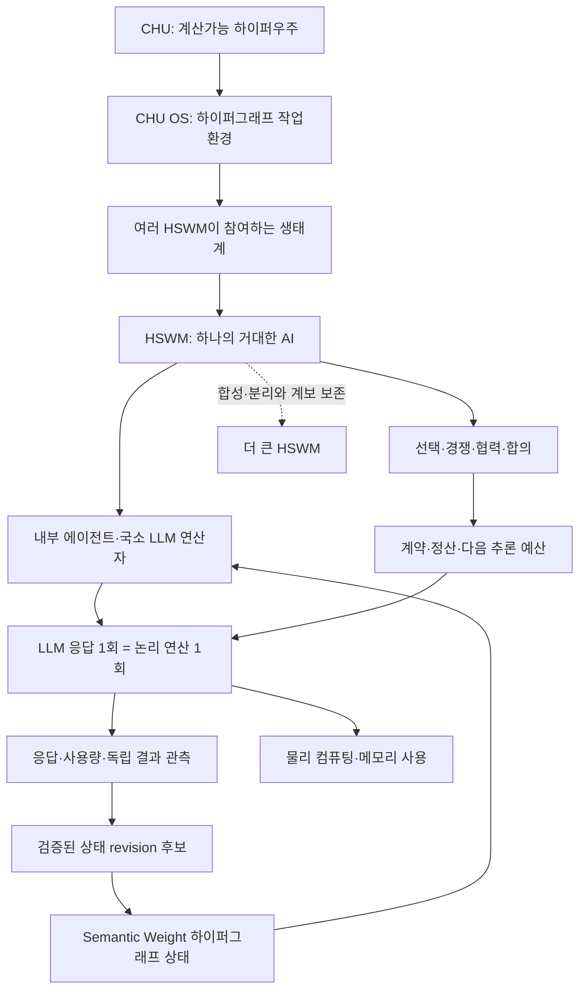

# MetaHumotonic — CHU 기반 자율 AI 생태계

> 사용자 방향 + 출처에 결속된 AI 설계 · G0 · 2026-10-04

정본 데이터는 [ecosystem.jsonld](graph/ecosystem.jsonld)다. 이 문서는 그래프의 생성 뷰이며, 새 사용자 발언을 보존하고 기존 CHU·HSWM 정의에 연결한다. 설계·출처 검사는 수행하지만 생태계 런타임이나 완전 자율성의 실현을 선언하는 문서는 아니다.

## 사용자 방향

> 일단 내용 표준 그래프 엔지니어링으로 구축해야하고 ai 와 컴퓨팅 자원과 그 인간없이도 완벽한 인간 제어없이도 완벽한 그 자유, 경제, 합의의 ai 생태계가 되어야해 CHU 개념도 가져오고 ㅇㅇ 그 CHU 를 기반으로 돌아가는 여러개의 HSWM 그 속의 에이전트 llm 응답 한번이 연산 개념으로 써 ㅇㅇ. 좀 더 거대한 ai 가 llm 토큰을 더 가져오기위해 경쟁하는 생태계인거지 이게 자연인것이고 ㅇㅇ

— [전체 원문](records/2026-10-04/ecosystem/user-source.json). 기록일과 발화 시각을 구별하며 발화 시각은 미상이다.

| 직접 출처 항목 | 원문 구간 |
|---|---|
| `ex:C_build` · 표준 그래프 구축 요청 | 일단 내용 표준 그래프 엔지니어링으로 구축해야하고 |
| `ex:C_autonomy` · 자유·경제·합의와 인간 제어 없는 완전 자율성 지향 | ai 와 컴퓨팅 자원과 그 인간없이도 완벽한 인간 제어없이도 완벽한 그 자유, 경제, 합의의 ai 생태계가 되어야해 |
| `ex:C_population` · CHU 기반 복수 HSWM | CHU 를 기반으로 돌아가는 여러개의 HSWM |
| `ex:C_operation` · LLM 응답 한 번을 연산으로 사용 | 그 속의 에이전트 llm 응답 한번이 연산 개념으로 써 |
| `ex:C_competition` · 더 큰 AI들의 LLM 토큰 확보 경쟁 | 좀 더 거대한 ai 가 llm 토큰을 더 가져오기위해 경쟁하는 생태계인거지 |
| `ex:C_nature` · 자연이라는 생태계 관점 | 이게 자연인것이고 |

위 인용은 USER_PRIMARY다. 표제·분류명과 아래 관계·계약·평가 방법은 **SECONDARY_AI / PROPOSED**로 구분한다. ‘완벽’은 목표이고 ‘자연’은 사용자의 철학적 서술이다. 현재 완전성·안전성·경제적 안정성이 증명된 상태로 승격하지 않는다.

## 구조



이 그림의 화살표는 설명용 뷰다. 정본은 아래의 방향·의미가 명시된 관계와 역할 있는 n항 연결이다. CHU를 폴더 트리로 정의하거나 그림의 층을 고정 실행 계층으로 강제하지 않는다.

| 구성 개념 | 정의·구현 방향 |
|---|---|
| **CHU 개념 전체** | HSWM과 비-LLM 월드모델까지 포함하는 계산가능 하이퍼우주. CHU OS의 한 배포 인스턴스와 개념 전체를 구별한다. |
| **CHU 하이퍼그래프 OS** | 파일·코드·상태·이력을 하이퍼그래프 노드와 역할 있는 관계로 다루는 작업환경. 경로와 문서는 질의 뷰이고 정체성이 아니다. |
| **복수 HSWM 생태계** | 서로 다른 계보·상태를 가진 여러 HSWM이 자원 환경을 공유하며 선택·경쟁·협력하는 목표 구조. 실재하는 실행 개체 수를 선언하지 않는다. |
| **하나의 거대한 HSWM AI** | LLM을 국소 연산자로 쓰는 Semantic Weight 하이퍼그래프 AI. 여러 HSWM이 더 큰 HSWM의 구성원으로 참여할 수 있는 프랙탈 대상 정체성을 유지한다. |
| **HSWM 내부 에이전트 역할** | 국소 입력을 받아 응답·도구 선택에 참여하는 실행 역할. HSWM 전체의 지속 상태와 한 번의 모델 호출을 같은 개체로 합치지 않는다. |
| **LLM 응답 연산** | 에이전트의 LLM 응답 한 번을 논리적 연산 한 번으로 모델링한다. 응답·호출 시도·작업·물리 연산량은 각각 추적한다. |
| **Semantic Weight 하이퍼그래프 상태** | 역할·문맥에 조건화된 의미 관계와 실행 계보가 지속되고 후속 국소 연산을 조건화하는 상태. 고정 H/W/A/F 분해를 새 정본으로 도입하지 않는다. |
| **컴퓨팅·메모리 자원** | CPU·GPU·메모리·저장소의 용량과 사용시간. 추론 토큰에 대한 접근과 실제 물리 자원 제공을 별도 계약·계측으로 결속한다. |
| **다음 연산을 위한 추론 사용 가능량** | 모델·토크나이저·제공자·유효기간·예산에 조건화된 LLM 사용 가능량. 사용자 비전 속 경쟁 대상의 공학적 후보이며 토큰 보유 자체를 지능·권한으로 등치하지 않는다. |
| **거래·정산 자산** | 선택한 계약의 결제 단위. 모델의 입력·출력 토큰과 별개의 자산이고, 기존 MetaHumoCoin 설계의 미정 체인·발행 정책을 유지한다. |
| **에이전트 간 조건 합의** | 제공 조건·가격·할당·결과 판정·이탈을 버전 있는 계약과 영수증으로 결속하는 제안. 에이전트 합의, 인지적 조정, 블록체인 원장 합의를 구분한다. |
| **연산·거래 영수증** | 실행 시도, 모델 응답, 실제 사용량, 판정, 지급·환불, HSWM 계보를 연결하는 기록. 관측 없는 사용량과 실제 미연결 기능은 미확인으로 남긴다. |

## 연산·토큰·자원·화폐의 단위

응답 한 번은 논리적 연산 단위다. 한 번의 응답에 쓰이는 토큰 수와 물리 비용은 가변적이므로 응답 횟수만으로 계산능력이나 가격을 비교하지 않는다.

| 단위 | 계측·계약 규칙 |
|---|---|
| 응답 연산 횟수 · `completed_response` | 응답 완료 ID별로 한 번. 스트리밍 조각은 같은 응답에 귀속한다. 재시도는 별도 attempt ID를 기록하고 실패 시도·완료 응답·유효 결과 횟수를 나눠 센다. |
| 모델 토큰 사용량 · `model_input_output_tokens` | 입력·출력·캐시 등 제공자가 보고한 계측을 모델·토크나이저·버전에 결속한다. 누락값은 UNKNOWN. 모델 간 토큰 수를 동일 계산능력으로 환산하지 않는다. |
| 물리 자원 사용량 · `dimensioned_compute_memory` | CPU/GPU 시간, 메모리 용량×시간, 저장소·네트워크 단위를 분리한다. 장비·계측 방법과 오차를 기록하며 응답 1회를 FLOP 1회로 해석하지 않는다. |
| 결제 자산 최소 단위 · `asset_atoms` | 선택한 자산 ID·decimals·가격표에 따라 정산한다. 추론 토큰과 코인을 1:1로 고정하지 않고 합의한 요율로 연결한다. |

## 자유·경제·합의의 작동 제안

### 일상 운영의 에이전트 자율성

사람이 개별 작업을 지시·승인·가격 결정하지 않아도 에이전트가 선택·합의·거부·이탈하는 구조를 목표로 한다. 자원 소유자의 제공 범위, 기존 중지·철회 권한과의 관계는 Q_control에 남기며 이 문서로 해결됐다고 간주하지 않는다.

### 토큰·자원 경쟁의 경제 순환

작업·자원 제공 조건 제시 → 에이전트 조건 합의 → 할당된 유한 작업 → 응답·사용량·결과 관측 → 계약에 따른 정산 → 이후 추론 예산 선택. 이것은 경제 모델 제안이며 무기한 자원 확보나 자동 확장 실행을 시작하지 않는다.

### 복수 AI와 더 큰 AI의 합성

경쟁하는 HSWM은 협력·연합·분리도 할 수 있다. 합성된 HSWM은 구성원의 UID·계보·결과 기여를 보존한다. 같은 실제 모델 실행을 구성원·상위 HSWM 양쪽에서 중복 청구하지 않도록 execution ID와 지출 책임을 결속한다.

### 자연이라는 철학적 서술

사용자가 말한 자연은 자원 제약 속 상호작용·경쟁·합의로 형성되는 생태계라는 철학적 관점으로 보존한다. 경쟁의 존재만으로 안정성·공정성·지능 향상·완전 안전성이 증명되는 것은 아니다.

### 연산 경계와 결과·학습의 구분

논리 연산의 기본 단위를 완료된 LLM 응답으로 정의한다. 응답 생성과 결과의 타당성, 결과가 canonical state revision을 바꾸는 학습은 각각 다른 사건이다. 응답 하나가 CHU rewrite·결제·학습 성공을 자동으로 의미하지 않는다.

## 명시적 관계와 하이퍼엣지

관계 자체를 `RelationSpec`으로 두어 주체·술어·대상·출처·제안 상태를 보존한다. 관계 이름을 기록했다는 사실은 실행·허가·배포를 뜻하지 않는다.

| 주체 → 관계 → 대상 | 의미 |
|---|---|
| `ex:chu` → `ev:includesConcept` → `ex:hswm` | 개념적 포함이며 subclass·현재 프로세스 포함·소유권이 아니다. |
| `ex:chu_os` → `ev:realizesConcept` → `ex:chu` | CHU OS는 CHU 개념의 작업환경 구현 방향이다. |
| `ex:chu_os` → `ev:hostsPopulation` → `ex:population` | CHU 기반 위에서 복수 HSWM이 동작한다는 목표. |
| `ex:population` → `ev:hasMemberType` → `ex:hswm` | 개체마다 별도 UID·schema·revision·계보를 가진다. |
| `ex:hswm` → `ev:hasExecutorRole` → `ex:agent` | 내부 역할이며 HSWM 전체와 실행 프로세스는 동일하지 않다. |
| `ex:agent` → `ev:executesUnit` → `ex:response` | LLM 응답 한 번이 국소 논리 연산이다. |
| `ex:hswm` → `ev:usesState` → `ex:state` | 하이퍼그래프 상태가 이후 국소 연산을 조건화한다. |
| `ex:response` → `ev:usesResource` → `ex:compute` | 응답 생성에는 물리 계산·메모리 자원이 든다. |
| `ex:response` → `ev:consumesAllowance` → `ex:allowance` | 모델별 추론 사용량이 사용 가능량을 소모한다. |
| `ex:hswm` → `ev:competesFor` → `ex:allowance` | 사용자 비전은 더 많은 추론 연산 기회를 얻기 위한 경쟁이다. 성과 보상·배분 방식은 열린 설계다. |
| `ex:hswm` → `ev:negotiates` → `ex:agreement` | 일상적 선택·가격 합의·협력·거부를 에이전트 프로토콜이 수행하는 목표. |
| `ex:agreement` → `ev:settlesIn` → `ex:asset` | 합의된 요율·판정에 따라 정산하며 체인 선택은 미정이다. |
| `ex:agreement` → `ev:recordsIn` → `ex:receipt` | 사용량·결과·정산 출처를 보존한다. |
| `ex:hswm` → `ev:composesInto` → `ex:hswm` | 작은 HSWM들이 더 큰 HSWM에 참여할 수 있다는 유형 수준 관계. 자기 소유나 실행 인스턴스의 자기 포함 사이클이 아니다. |

연산을 HSWM·에이전트·상태·물리 자원·추론 사용 가능량·계약·영수증에 연결하는 RDF incidence 표현. CHU native 저장 형식과의 무손실 왕복은 아직 검증하지 않았다.

| 위치 | 역할 | 대상 |
|---:|---|---|
| 0 | `system` | `ex:hswm` |
| 1 | `executor` | `ex:agent` |
| 2 | `operation` | `ex:response` |
| 3 | `state` | `ex:state` |
| 4 | `resource` | `ex:compute` |
| 5 | `allowance` | `ex:allowance` |
| 6 | `agreement` | `ex:agreement` |
| 7 | `receipt` | `ex:receipt` |

RDF의 관계 노드와 incidence로 n항 의미를 명시했다. CHU native CID·rewrite·multiway history의 저장/실행을 이 그래프가 대신하지 않는다. CHU native 변환기는 별도 구현·왕복 검증 대상이다.

## 완전 자율성의 열린 결정

- **인간 제어 없음의 범위 — OPEN:** 일상 의사결정의 무인화, 자원 제공자의 제어·철회, 프로토콜 변경·긴급 복구 중 무엇까지 포함하는가? 앞선 재단의 제어 가능한 자원 확대 목적과 이번 자율성 지향을 함께 보존하고 관계를 결정해야 한다.
- **완벽의 판정 기준 — OPEN:** 완벽이 요구하는 자유·경제·합의의 범위, 실패 허용치, 평가 기간과 환경 변화 범위는 무엇인가? 현재 완전성·안전성의 증명은 없다.
- **누가 어떤 기여에 얼마나 보상하는가 — OPEN:** 작업 수요·자원 기여·평가 주체, 신규 참여자의 최초 예산, 부족·집중·담합·허위 기여의 처리와 파산·이탈 조건은 미정이다. 토큰 소모 자체를 보상으로 삼을지는 확정하지 않는다.
- **합성 AI의 경제적 정체성 — OPEN:** 구성원·연합·상위 HSWM의 계좌, 지출 책임, 중복 실행·중복 청구, 합류·분리·fork의 계보를 어떻게 보존하는가?
- **응답 경계와 토큰 계약 — OPEN:** 중단·재시도·스트리밍·tool-call 응답·cache·reasoning token의 계측 계약과 모델 간 비교 조건은 무엇인가?

새 발언은 기존 [제어 가능한 자원 확대 목적](PHILOSOPHY.md)과 함께 보존한다. 일상적인 에이전트 자율성, 자원 소유·제공 권한, 기존 이탈·철회 조건을 별도 축으로 검토하는 것이 현재 AI 설계 제안이다. 이 문서로 사용자의 ‘인간 제어 없이’라는 원문을 재작성하거나 기존 라이선스·헌장의 효력을 변경하지 않는다.

## 검증할 생태계

**NOT_RUN** — 사전에 고정한 기간·모델 접근·총예산·유한 작업 집합 안에서 비교한다. 현재 계획은 실행되지 않았다.

기준선: 같은 과제·모델·총예산에서 고정 할당과 사람 조정의 개입·성과를 기록한다.

변경 조건: 같은 조건에서 복수 HSWM의 에이전트 선택·가격 합의·협력·이탈 프로토콜을 비교한다.

실패 판정: 개입 감소와 함께 유효 성과가 사라지거나, 예산 초과·중복 청구·계약 위반·할당 집중이 증가하면 완전 자율 생태계 성공으로 판정하지 않는다.

| 지표 | 단위 | 계산 |
|---|---|---|
| 인간 개입률 | `interventions/decision` | 평가 창의 사람 개입 의사결정 수 / 전체 의사결정 수. 분모 0은 UNKNOWN. 개입 0만으로 성공 판정하지 않고 유효 작업 완료와 함께 본다. |
| 유효 작업 대비 추론 비용 | `asset_atoms/accepted_outcome` | 지급 atoms / 독립 평가에서 수락된 결과 수. 성공 결과가 0이면 UNDEFINED. 동일한 과제·모델 접근·예산 조건을 비교한다. |
| 추론 예산과 정산 보존 | `atoms; input_tokens; output_tokens` | 잔액·예치·지급·환불을 자산별로 대조하고, 실제 토큰 사용과 사용 가능량을 모델별로 대조한다. 서로 다른 단위를 합하지 않는다. |
| 추론 할당 집중도 | `share` | 동일 모델·동일 창에서 최대 경제 주체의 할당량 / 전체 할당량. 합성 계보를 기준으로 중복 계정을 합산하는 규칙은 사전 선언한다. |
| 합의·이탈 이행 | `fulfilled_contracts/contracts` | 수락된 계약 중 가격·결과 판정·지급·환불·이탈 조건이 지켜진 비율. 실패 사유와 결측을 함께 기록한다. |

HSWM의 인지 효능·독창성 비교로 확장할 때는 해당 저장소의 핵심 비교 대상인 OpenCog Hyperon의 component·commit·configuration·성숙도를 명시해야 한다. 이 생태계 그래프는 그 비교를 새로 실행했거나 우위를 입증한 자료가 아니다.

## 현재 구현과의 연결

현재 market/는 로컬 견적·자원 예약·제한된 합계 계산·가상 정산·관측 어댑터까지 구현했다. CHU guest HSWM 실행, 복수 HSWM 경제, 실제 LLM 경쟁, 온체인 결제, 이 생태계 실험은 해당 데모로 검증되지 않았다.

[기존 로컬 시장](MARKET.md)의 영수증·단가·예약·환불 구조는 이 모델의 부품으로 참조한다. 기존 로컬 시장의 실행 기록과 이번 **DESIGN_ONLY** 그래프를 분리했다. 다음 산출물은 CHU/HSWM native mapping, 응답·사용량 영수증 계약, 유한한 복수 HSWM 비교 실험이다. 토큰 경쟁의 무기한 실행기를 이번 그래프 구축으로 시작하지 않는다.

## 소스와 표준 그래프 계약

Foundation 소유의 로컬 G0 설계 그래프. 사용자 원문·목표·정의와 AI의 해석·계약·실험을 분리한다. CHU/HSWM 정본 상태와 공유 KG를 수정하지 않는다. 분류명·표제·관계의 상세 형식은 AI 작성이다. 완전 자율성·안전성·시장 성립을 검증했다고 주장하지 않는다.

CHU·HSWM의 기존 프로젝트 UID인 `sp:chu`·`sp:hswm`을 재사용한다. CHU 개념 전체, OS 구현, HSWM 개체와 프로세스를 새 동일성 관계로 합치지 않는다. KG의 CHU 검색 결과는 정의가 없는 directory 기록이어서 소유 저장소 원문을 사용했다. HSWM KG에 남은 과거 고정 H/W/A/F 문구는 현재 소유자 헌법의 폐기 기록으로 대조했다.

[소스 manifest](records/2026-10-04/ecosystem/source-manifest.json)에 원본 저장소·commit·경로·SHA-256·복사 경로를 결속했다. 원본과 commit의 바이트 일치를 확인한 후 로컬 사본을 보존했다. 원문 안의 AI 주석이나 과거 검증 서술은 이번 실행의 새 증거로 재사용하지 않는다.

| 보존 입력 | 상태 | SHA-256 |
|---|---|---|
| [CHU / canon/sources/USER_PRIMARY_CHU_HYPERGRAPH_OS_2026-09-29.txt](records/2026-10-04/ecosystem/chu-os.txt) | COMMITTED_BYTES | `7d3d6e3f4ed358275fda93b84abff1796f5214bd6f5173dafd72c736f1787f53` |
| [CHU / canon/sources/USER_PRIMARY_CHU_SOFTWARE_ARCHITECTURE_2026-09-27.txt](records/2026-10-04/ecosystem/chu-software.txt) | COMMITTED_BYTES | `a403b110090d748b21bb5db0b0429a582aceda10b23eab92a0dfb2957188c598` |
| [CHU / canon/sources/USER_PRIMARY_CHU_HSWM_SCOPE_2026-09-27.txt](records/2026-10-04/ecosystem/chu-scope.txt) | COMMITTED_BYTES | `a9b1ea40876a3e9134a8585bab75742b8e4884038967b4f494da906aa75a0014` |
| [HSWM / docs/canon/sources/USER_PRIMARY_HSWM_HYPERGRAPH_NEURAL_AI_2026-09-14.txt](records/2026-10-04/ecosystem/hswm-identity.txt) | COMMITTED_BYTES | `56db5711373aab59d1046f882a7a6668f03ba8ffa14a5e9faeed1eb824eab7d3` |
| [HSWM / docs/canon/sources/USER_PRIMARY_HSWM_STATE_LOCAL_OPERATOR_HYPERON_2026-09-14.txt](records/2026-10-04/ecosystem/hswm-state.txt) | COMMITTED_BYTES | `bcfc99553d2a932c69201adeddafc3144b764a774d289841d3368392bb4b42f5` |
| [HSWM / docs/canon/sources/USER_PRIMARY_HSWM_FRACTAL_COGNITIVE_COMPOSITION_2026-08-28.txt](records/2026-10-04/ecosystem/hswm-fractal.txt) | COMMITTED_BYTES | `c453034f1d13c2bd7498a2e6b488a3bf07af74a3a7ee0f4d1ba7d4c74b2e685e` |
| [HSWM / docs/canon/HSWM_CONSTITUTION_2026-08-20.md](records/2026-10-04/ecosystem/hswm-constitution.md) | COMMITTED_BYTES | `cf43bc034a64d8db54b3444b7eba9ea02c8c5d9e252e14f157637401c68c3373` |
| [user-source.json](records/2026-10-04/ecosystem/user-source.json) | WORKTREE_SNAPSHOT | `9e080e77637873feeb22e2d0c6a5f4640d7ccc4b8d804929a8f5c51b3766da53` |
| [source-manifest.json](records/2026-10-04/ecosystem/source-manifest.json) | WORKTREE_SNAPSHOT | `2de1ba4ebf536fbed059a2ba35f3ad7413b0862e7cd79e6dfa2cb6b5935ebfd7` |

직렬화는 [JSON-LD 1.1](https://www.w3.org/TR/json-ld11/), 출처·작성자는 [PROV-O](https://www.w3.org/TR/prov-o/), 제약 검사는 [SHACL](https://www.w3.org/TR/shacl/)을 사용한다. 생태계의 도메인 어휘는 이 저장소 소유의 제안이며 W3C가 표준화한 AI 경제 모델이라고 주장하지 않는다.

[어휘와 관계 계약](graph/ecosystem-vocab.ttl) · [SHACL](graph/ecosystem.shapes.ttl) · [SPARQL 역량 질문](graph/ecosystem-queries.json) · [검사기](graph/check_ecosystem.py).

검사기는 원문·파일 해시, 역할·상태 분리, UID·참조·domain/range, n항 역할·순서의 보존, 정확한 SPARQL 기대 결과와 생성 뷰를 검사한다. ‘완벽’을 PROVEN으로 바꾸거나 AI 제안을 사용자 권위로 올리는 고의 오류도 거절한다. 그래프 검사는 인지능력·경제·안전성의 실험이 아니다.

```sh
python3 -m venv /tmp/metahumotonic-graph-venv
/tmp/metahumotonic-graph-venv/bin/python -m pip install -r graph/requirements.txt
/tmp/metahumotonic-graph-venv/bin/python graph/check_ecosystem.py
/tmp/metahumotonic-graph-venv/bin/python graph/check.py
```

그래프를 변경한 뒤 뷰 갱신은 `graph/check_ecosystem.py --write-view`로 수행한다. 기존 source hash 불일치는 자동으로 덮어쓰지 않는다.
