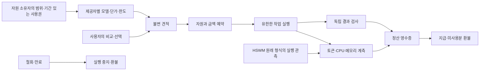

# MetaHumotonic — 자원·AI 토큰·정산 시장 구현

**작동하는 로컬 프로토타입**이다. 제공자별 조건 비교, 자원 사용권, 원자적 예치,
제한된 실제 계산, 독립 결과 검사, 지급·환불과 JSON-LD 영수증을 연결한다.
결제 단위는 `sandbox:SIM-MHC`이며 실제 암호화폐 발행·전송은 하지 않는다.
새 [사용자 요청 원문](records/2026-10-04/market-source.json)은 별도로 보존한다.

## 하나로 묶이는 것



**AI 토큰은 모델 입력·출력 사용량, 코인은 결제 자산으로 해석했다.** 서로 환산율이 고정된
같은 물건으로 만들지 않는다. 모델·토크나이저가 같은 제공자들의 조건을 비교하고,
선택한 가격표가 사용량을 자산의 최소 단위로 변환한다. `total_tokens`를 별도 요금으로
다시 더하지 않는다. 공개 가격은 보장 수익이나 미래 발행량을 뜻하지 않는다.

## 실행

Linux, Python 3.10 이상과 표준 라이브러리만 있으면 시장을 실행할 수 있다.
고정된 합계 계산 외의 셸·임의 코드는 실행하지 않는다. 새 디렉터리를 사용한다.

```sh
python3 -m market demo --output-dir /tmp/metahumotonic-market-demo
python3 -m market status --db /tmp/metahumotonic-market-demo/market.sqlite3
python3 -m market export --db /tmp/metahumotonic-market-demo/market.sqlite3 \
  --output-dir /tmp/metahumotonic-market-export
python3 -m market sweep --db /tmp/metahumotonic-market-demo/market.sqlite3
```

데모의 두 제공자는 같은 모델·토크나이저 예제 조건으로 각각 최대 **508**, **648 atoms**를
견적한다. 데모 호출자가 508 견적을 선택하고, 실제 로컬 계산을 실행한 뒤 사용량만큼
정산한다. 다른 거래는 시작 전 취소하여 전액 돌려준다. 계측값은 실행마다 달라질 수 있다.

| 항목 | 제공자 B 예제 단가 | 실제 적용 |
|---|---:|---|
| 입력 토큰 | 2 atoms/token | 예제 100 tokens |
| 출력 토큰 | 4 atoms/token | 예제 20 tokens |
| CPU | 1/10 atoms/ms | 로컬 프로세스 CPU 시간 |
| 메모리 | 1/1000 atoms/(MiB·ms) | 최고 RSS × 작업 경과 시간 |

예제 토큰 요금은 280 atoms이며 여기에 실제 로컬 계측 요금을 합친 뒤 **총액에서 한 번만
올림**한다. 물리 계산과 추론을 묶어 청구하는 조건을 가격표에서 명시한다. 제공자는
원하지 않는 요금 항목을 0으로 제시할 수 있다. 메모리 계측은 시간 적분이 아니라
최고 RSS 기반의 명시된 근사다. GPU·VRAM·영속 저장소 계측은 이번 실행기에 없다.

생성물은 `market.sqlite3`, `market.json`, `market.jsonld`, `demo.json`이다.
개인 등록이나 실제 관측을 사용한 파일은 로컬에 보관한다. CLI가 업로드하거나 서비스를
공개하지 않는다. 데이터베이스는 소유자만 읽고 쓰도록 파일 모드를 설정한다.

[보존한 실행 기록](records/2026-10-04/market-demo/demo.json)에서는 508 atoms를 예치하고
281 atoms를 지급한 뒤 227 atoms를 반환했다. 별도의 취소 거래는 648 atoms를 전액
반환했다. [원본 원장](records/2026-10-04/market-demo/market.json),
[그래프](records/2026-10-04/market-demo/market.jsonld),
[소스·산출물 해시와 실행 환경](records/2026-10-04/market-demo/run.json)을 함께 보존한다.
이 금액은 예제 추론 토큰과 한 번의 로컬 계측 결과이며 실제 서비스 시세가 아니다.

## 구현한 시장 규칙

- **선택:** `discover()`가 모델·토크나이저·실행 종류가 맞는 공개 견적을 반환한다.
  호출자가 명시적으로 선택한다. 조회만으로 자원이나 자금을 예약하지 않는다.
- **가격 합의:** 제공자의 불변 standing offer와 사용자의 견적 수락을 결속한다.
  가격 변경은 새 offer ID로 한다. 제공자의 offer 철회는 새 거래를 막으며 이미
  수락된 계약의 가격을 바꾸지 않는다.
- **범위:** 자원 ID·소유자·제공자·USL ID·한도·기간을 기록한다. 계좌 잔액이나
  USL 링크가 자원 권한을 생성하지 않는다. 여러 grant가 같은 자원을 중복 증식시키지 않는다.
- **예치:** SQLite `BEGIN IMMEDIATE` 안에서 자원 슬롯·메모리와 잔액을 함께 예약한다.
  동시 요청의 중복 배정과 초과 지출을 거절한다. 잔액 합+미정산 예치 합은 초기 총량이다.
- **실행:** 고정 합계 작업을 별도 프로세스 그룹에서 실행한다. 주소 공간·CPU 시간·벽시계
  시간·출력 파일 크기를 제한한다. 프로세스는 한 CPU affinity에 묶이며 자체 종료 타이머도 가진다.
- **중지:** 실행 중 취소·grant 철회·만료를 감독기가 확인해 종료하고 `wait()` 뒤 환불한다.
  종료 확인 전에는 슬롯을 다시 팔지 않는다. 일반 적대적 코드의 격리 환경으로 사용할 수 없다.
- **제어기 장애:** `sweep()`은 실행 기한+1초 뒤 미확인 작업의 자금을 반환하고 자원을
  `QUARANTINED`로 남긴다. 소유자의 종료 확인 기록이 있어야 다시 사용 가능하게 한다.
  장부의 환불을 실제 프로세스 종료 증거로 해석하지 않는다. 자동 재실행·권한 갱신은 없다.
- **결과 판정:** 반복문으로 계산한 합계를 별도의 닫힌 수식으로 검사한다. 잘못된 결과나
  사용량 상한 초과에는 지급하지 않는다. 일반 LLM 답변의 진실성 검증까지 구현한 것은 아니다.
- **정산:** 이 로컬 시험 정책에서는 검증된 완료 작업만 지급하며 실패·취소는 전액 환불한다.
  실패 작업의 비용은 제공자 부담이므로 실제 시장 정책으로 채택할지는 별도 결정이다.
  같은 완료 요청을 다시 보내도 같은 영수증을 반환하며 추가 지급하지 않는다.

자원 장부의 풀 크기는 **OPERATOR_DECLARED_LOCAL_POOL**이다. 슬롯 예약은 집행하지만,
제공자가 주장한 원격 하드웨어의 존재·성능·지속 가용성을 검증했다고 표시하지 않는다.
행위자 이름은 신뢰된 로컬 프로세스의 역할이며, 타인의 신원·지갑 서명을 인증하지 않는다.
따라서 이 API를 그대로 다중 사용자 네트워크 서비스로 노출해서는 안 된다.

## HSWM 연결

현재 HSWM의 `AdaptiveExecution.metadata.execution_observation_v1.provider_usage`를 읽는
[어댑터](market/contracts.py)를 구현했다. 기존 `prompt_tokens`, `completion_tokens`,
`total_tokens`를 그대로 검증한다. 출력 digest·cell ID·configured model·설정 digest도
계약의 대상과 대조하며, 빠진 계측을 0으로 채우지 않는다.

소스는 [HSWM adaptive-executor.ts의 고정 revision](https://github.com/gj3447/HSWM/blob/58f1d4f08352c33c8481f7bf2553d95e6896a091/src/hswm/effect-runtime/src/adaptive-executor.ts)에서 확인했다.
[연동 명세](market/interop.json)에 commit·파일 SHA-256·스키마·필드 대응을 기록했다.
HSWM 저장소나 canonical graph·학습 상태는 수정하지 않았다. 현재 runtime의 원래
실행·admission 소유권을 유지한다.

실제 관측 파일의 토큰 견적은 다음처럼 계산할 수 있다. `offer.json`은 `asset`, `rates`,
`model`, `cell_id`, `configuration_sha256`을 가진 불변 제공 조건 객체다.

```sh
python3 -m market quote-hswm --execution execution.json --offer offer.json
```

이 명령은 **QUOTE_ONLY_PROVIDER_REPORTED**를 반환하고 자금을 이동하지 않는다. 원래
HSWM 관측에 CPU·메모리 계측이 없으면 해당 값은 `null`로 남는다. 물리 사용량에 가격이
붙어 있는데 계측이 없으면 견적을 거절한다. 제공자 보고와 독립 결과 검증을 구분한다.

데모의 `fixture-hswm`은 이 원래 형식에 맞춘 **예제 토큰 사용량**이며 모델 호출은 0회다.
실제 HSWM 연결 상태는 **NOT_READY**다. 저장소 OWNER 규칙이 요구하는 등록된
USL mapping, 지정 수신자·범위·만료·철회, 승인된 transport의 제한된 reachability 확인,
HSWM 소유 실행 capability가 아직 구성되지 않았다. 단순한 설정 boolean으로 이를
통과시키는 우회 경로는 만들지 않았다.

## 암호화폐 연결과 금융 범위

이번에 구현한 금융 동작은 **견적·예산·예치·지급·환불·보존 검사**다. 실제 체인·자산은
미정이며 원장은 실물 자산으로 상환 가능한 채무나 온체인 자산을 표시하지 않는다.
`sandbox:SIM-MHC`를 실제 MHC 발행 또는 초기 분배로 읽지 않는다.

실제 연결에는 선택한 chain ID와 자산 주소/denom, decimals, 지갑 서명,
결제 컨트랙트 또는 체인 모듈, finality/reorg 처리와 입출금 대조가 필요하다.
로컬 예치 트랜잭션과 체인 트랜잭션을 하나의 원자적 작업이라고 가정하지 않고,
확정 영수증·재시도 키·보상 처리를 갖춘 별도 결제 adapter로 연결해야 한다.
기존 [MetaHumoCoin 결정 그래프](METAHUMOCOIN.md)의 미결정 정책은 유지했다.

## 그래프와 검사

`MarketSnapshot → Offer/Grant/Order → Usage/Receipt`로 원본 JSON을 정확하게 투영한다.
자원 소유자, 거래 당사자, 모델·토크나이저, 단위별 사용량, 결제 자산과 금액을 분리한다.
`Offer → UnitPrice → Asset`에서 토큰·CPU·메모리별 단가의 분자와 분모를 직접 조회한다.
PROV-O로 투영 활동을 기록하며 기존 로드맵 단계는 `dcterms:references`로 연결한다.
이전 로드맵은 당시 설계 스냅샷으로 보존하고 새 로컬 실행 기록을 별도로 만든다.

[어휘](graph/market-vocab.ttl)·[SHACL](graph/market.shapes.ttl)·[검사기](graph/check_market.py)가
타입·관계·단위·출처와 정확한 RDF 투영, SPARQL 결과를 확인한다. 해시 체인은 일관성
검사이며 외부에 서명·고정된 원장의 진위나 합의 증명은 아니다.

```sh
python3 -m unittest discover -s market -t .
python3 -m unittest discover -s economy -t .
/tmp/metahumotonic-graph-venv/bin/python graph/check_market.py
/tmp/metahumotonic-graph-venv/bin/python graph/check_market.py \
  --snapshot /tmp/metahumotonic-market-demo/market.json \
  --graph /tmp/metahumotonic-market-demo/market.jsonld
/tmp/metahumotonic-graph-venv/bin/python graph/check.py
```

검증 범위는 실제 로컬 프로세스 실행·철회·시간 제한, 원자적 예약, 재시작한 원장,
잘못된 결과·토큰 보고 거절, 환불·중복 정산과 그래프다. 실제 모델 성능·시장 유동성·
실제 암호화폐 결제는 아직 이 시험으로 검증하지 않았다.

그래프 검사 환경이 없으면 `python3 -m venv /tmp/metahumotonic-graph-venv`로 만들고
`/tmp/metahumotonic-graph-venv/bin/pip install -r graph/requirements.txt`로 고정된 의존성을 설치한다.

다음 구현 순서는 실제 HSWM 실행 capability와 사용량 영수증 연결, 선택한 체인의
테스트넷 결제 adapter, 서로 다른 제공자의 실제 작업 비교다. 시장 성립은 가격표 수로
판정하지 않고 견적 대비 완료 비용, 작업 성공률, 취소·환불 완료, 사용자가 실제로 선택한
제공자의 분포로 관측해야 한다. 자원 확대도 코인 가격 대신 유효한 사용권과 집행 가능한
가용량으로 측정한다. 이들은 후속 실험 제안이며 아직 얻은 성과가 아니다.

사용한 표준 라이브러리의 계약:
[SQLite 트랜잭션](https://docs.python.org/3/library/sqlite3.html),
[프로세스 자원 제한](https://docs.python.org/3/library/resource.html),
[프로세스 감독](https://docs.python.org/3/library/subprocess.html).
