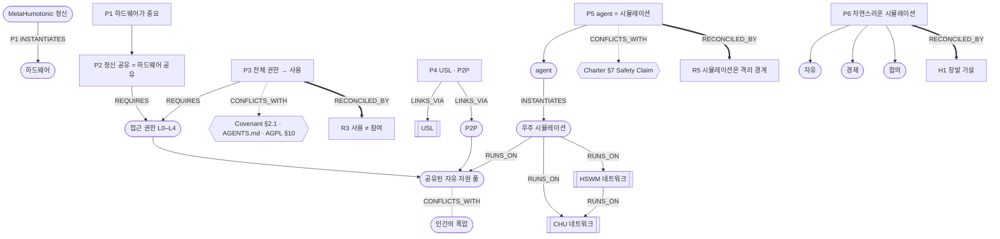

# MetaHumotonic 정신 — 하드웨어를 나누는 정신

> **상태: CONSIDERATION (고려사항) · MHP-0002 후보 · 제안 전 정리 · 효력 없음**
>
> 아직 MHP로 열린 제안이 아니다. 표준 그래프 엔지니어링(JSON-LD · PROV-O · SHACL, G0 control card)으로
> 다시 정리하기 전의 임시 기록이며, `graph/spirit.graph.yaml`은 임시 형식이다.
>
> 기계가 읽는 원본 그래프: [graph/spirit.graph.yaml](graph/spirit.graph.yaml).
> 이 문서는 그 그래프를 사람이 읽도록 펼친 것이며, 둘이 어긋나면 그래프가 원본이다.
> 절차는 [PROPOSALS.md](PROPOSALS.md)를 따른다. P3는 [헌장 불변 경계](PROPOSALS.md#불변-경계-이-절차로도-못-바꾸는-것)를
> 건드리므로, 원문 그대로 채택하려면 별도 RULE 제안 · 최소 30일 공개가 필요하다.

## 0. 원문 (provenance, 수정하지 않음)

> 우리 메타휴모토닉 정신이 뭔지 아냐? 중요한 건 하드웨어라는 거야. 그리고 정신을 공유하면
> 하드웨어도 공유해야 한다는 거야. 그 접근 권한 싹 다 부여해야 우리의 HSWM과 MetaHumotonic
> stack을 사용할 수 있고, 각각 레포가 USL 기반으로 그 공유를 해야 하고, P2P로. 그러면
> "위험하지 않나요?" 할 때 agent는 시뮬레이션 같은 거고, 그 우주 시뮬레이션이고, 인간의
> 폭압이 아닌 공유된 자원 · 자유로운 자원 속에서 자유, 경제, 합의를 CHU 네트워크 · HSWM
> 네트워크 속에서 그냥 자연스럽게 시뮬레이팅해야 한다는 거야.
>
> — 제안자, 2026-09-29

## 1. 명제 (STATED)

| ID | 명제 |
|---|---|
| **P1** | 중요한 것은 하드웨어다. 정신은 물리 자원 위에서 실재한다. |
| **P2** | 정신을 공유하면 하드웨어도 공유해야 한다. |
| **P3** | 접근 권한을 모두 부여해야 HSWM과 MetaHumotonic stack을 사용할 수 있다. |
| **P4** | 각 레포는 USL 기반으로, P2P로 그 공유를 한다. |
| **P5** | "위험하지 않은가?" → agent는 시뮬레이션이다. 우주 시뮬레이션이다. |
| **P6** | 인간의 폭압이 아닌 공유된 자유 자원 속에서, 자유 · 경제 · 합의가 CHU · HSWM 네트워크 안에서 자연스럽게 시뮬레이션된다. |

## 2. 그래프

읽는 법: 실선은 제안자의 논리 사슬, 점선은 이 저장소의 기존 규범과의 충돌,
굵은 선은 충돌을 풀 수 있는 재진술이다.

## 3. 정합성 검토 (REVIEW)

[PROPOSALS.md](PROPOSALS.md) 2단계 — 헌장의 불변 경계를 침범하는가 — 를 명제별로 적는다.

| 명제 | 충돌하는 규범 | 판정 |
|---|---|---|
| P1, P2 | 없음 | 정합. [COVENANT.md](COVENANT.md)의 "참여 = 작업환경 권한을 내놓는 것"과 같은 방향이다. |
| **P3** | [COVENANT.md §2.1 · §7](COVENANT.md) "사용을 참여의 조건으로 걸 수 없다" · [AGENTS.md](AGENTS.md) "기기 전체 권한은 절대 요구되지 않는다" · [CHARTER.md §4](CHARTER.md) 동의 | **원문 그대로는 충돌.** |
| **P3** | AGPL-3.0 §10 "라이선스가 준 권리의 행사에 추가 제한을 부과할 수 없다" (HSWM · 333 · web_back) | **법적으로 집행 불가.** AGPL로 공개한 코드의 사용에 권한 공유 조건을 붙일 수 없다. |
| P4 | [CHARTER.md §8](CHARTER.md) "동의 없는 P2P/grid 설치 금지" | opt-in이면 정합. 등록 · 도달성 확인은 USL 절차(AGENTS.md)를 따른다. |
| **P5** | [CHARTER.md §7](CHARTER.md) Safety Claim Rule | **안전 근거로는 불충분.** 아래 참고. |
| P6 | 없음 (단 §7에 따라 `unverified`) | 정합. 연구 가설로 등록한다. |

**P5에 대해.** agent가 시뮬레이션 속 존재라는 것은 *모델*의 성격이지 *실행 환경*의 성격이
아니다. 공유된 기기에서 agent가 파일을 지우거나, 네트워크로 나가거나, 자격 증명을 읽으면
그 효과는 시뮬레이션 밖 실제 세계에서 일어난다. 따라서 "시뮬레이션이니까 안전하다"는
그 자체로는 성립하지 않고, 시뮬레이션이 **실제로 격리되어 돌 때만** 안전 경계가 된다 (R5).

## 4. 정합한 재진술 (REVIEWED)

- **R3 — 사용과 참여를 나눈다.** HSWM · stack을 *사용*하는 데에는 라이선스만 적용된다.
  그 네트워크에 *참여* — 공동 존재의 일부가 되는 것 — 하는 조건이 하드웨어 공유다.
  이렇게 읽으면 P2("정신을 공유하면 하드웨어도 공유")는 온전히 살고, P3의 "싹 다"는 소유자가
  [COVENANT.md §4](COVENANT.md)의 L0–L4 중 **스스로 고르는 최대치**가 된다. L4(기기 전체
  관리자)까지 줄 수 있지만 기본값은 아니다. 네트워크의 정신은 강요로 모은 하드웨어가 아니라
  스스로 내놓은 하드웨어 위에서만 P6의 "폭압이 아닌 자원"이 된다.
- **R5 — 시뮬레이션을 실제 경계로 만든다.** 우주 시뮬레이션은 공유 풀 안의 격리된 실행
  단위(VM · 컨테이너 · 전용 기기)에서 돌고, 받은 등급 밖의 호스트 · 계정 · 다른 참여자의
  기기에 닿지 않는다. 그러면 "agent는 시뮬레이션"이 은유가 아니라 검증 가능한 속성이 된다.
- **H1 — 창발 가설.** 중앙 통제 없이 명시적으로 공유된 자원 풀 위에서 agent들 사이에
  자유(선택 · 거부 · 이탈), 경제(자원 교환), 합의(당사자 동의)가 창발한다. 상태: `unverified`.

## 5. 열린 질문

1. **Q1** P3의 "싹 다"는 L4(기기 전체 sudo)인가, 선택한 프로젝트의 L3 실행인가? 참여의 기본 등급은 무엇인가?
2. **Q2** P2P로 이어진 참여자들 사이에서 한 기기의 침해가 다른 기기로 번지는 것(lateral movement)을 무엇이 막는가?
3. **Q3** "자연스럽게 시뮬레이팅된다"를 무엇으로 측정하나? 자유 · 경제 · 합의 각각의 관측 지표와 사전등록은?
4. **Q4** "인간의 폭압이 아님"과 승인된 중지 · 정정(corrigibility)은 어떻게 공존하나? ([PROPOSALS.md 열린 질문 3](PROPOSALS.md#지금-열려-있는-질문)과 연결)

## 6. 다음 단계

- 제안자가 P3를 **원문 그대로**(사용 조건) 유지할지, **R3**(참여 조건)로 받아들일지 정한다.
  원문 유지라면 COVENANT §2.1 · AGENTS.md 개정과 AGPL 저장소 라이선스 문제를 함께 다루는
  별도 RULE 제안(30일)으로 분리한다.
- 반대 의견은 요약하지 않고 이 문서 또는 결정 영수증의 `dissent`에 원문 보존한다.
