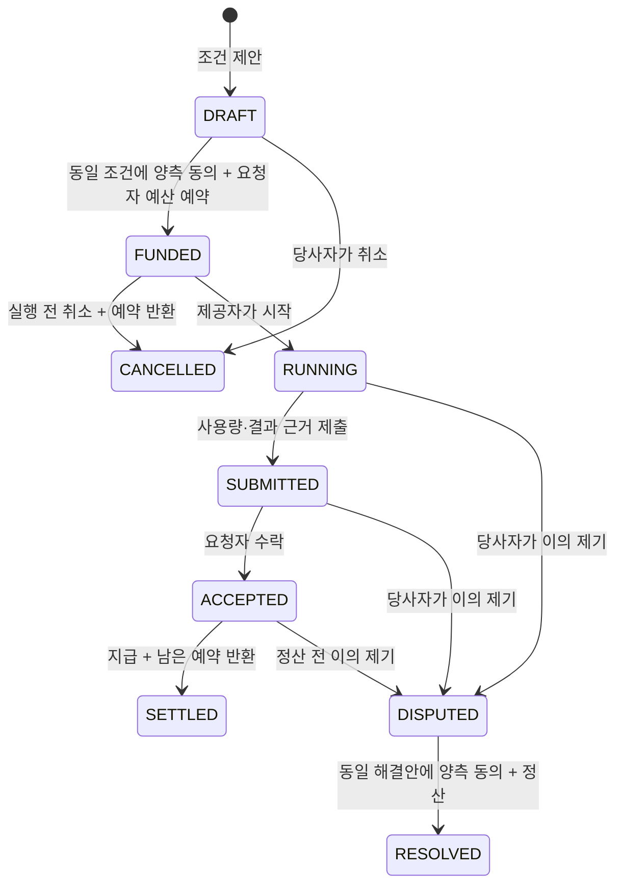

# MetaHumoCoin 로컬 경제 시뮬레이터

공유 기반 위에서 합의하고, 작업을 확인하고, 거래를 정산하는 흐름을 실행한다.
[경제 그래프의 `eco:D_simulation`](../graph/economy.jsonld)에 연결된 **SECONDARY_AI / PROPOSED** 실험 구현이다.
표시 단위는 가상 `SIM-MHC`이며 초기 잔액·예시 가격·정밀도는 실험 입력이다.
MetaHumoCoin의 실제 발행·배분·체인 정책은 [경제 설계의 열린 항목](../ECONOMY.md)에 남아 있다.

## 실행

저장소 루트에서 Python 3.10 이상으로 실행한다. 시뮬레이터와 재생기는 표준 라이브러리만 쓴다.

```sh
python3 -m economy demo --output-dir /tmp/metahumotonic-economy-demo
python3 -m economy verify /tmp/metahumotonic-economy-demo/simulation.json
```

출력 디렉터리를 생략하면 데모 요약만 출력한다. 지정하면 두 파일을 생성한다.
같은 경로에 다시 실행할 때 해당 생성 파일을 원자적으로 교체한다.

- `simulation.json`: 초기 잔액·입력 명령·최종 상태·이벤트·소스 해시를 담은 재현 묶음.
- `simulation.jsonld`: 계정·합의·이벤트·영수증과 설계 근거를 연결한 RDF 그래프.

데모는 다음 세 거래를 수행한다. 모든 숫자는 가상 표시 단위다.

| 거래 | 예약 | 처리 | 제공자 지급 | 요청자에게 예약 잔액 반환 |
|---|---:|---|---:|---:|
| 정상 거래 | 10 | 사용량 3 × 합의 단가 2, 요청자 수락 | 6 | 4 |
| 실행 전 취소 | 8 | 실행 전에 취소 | 0 | 8 |
| 분쟁 거래 | 12 | 청구 가능액 9에서 양측이 4 지급에 합의 | 4 | 8 |

초기 잔액은 `alice=100, bob=0, carol=0`이고, 최종 잔액은 `90, 10, 0`, 예약 잔액은 `0`이다.
정상 정산을 같은 operation ID로 재요청하는 경우도 포함한다. 영수증 2개와 상태 변경 이벤트 24개가 생성된다.

## 실험 정책



- **동의:** 조건의 SHA-256을 양 당사자가 수락한다. 조건은 제안 후 불변이고 새 조건은 새 합의 ID를 쓴다.
- **예약:** 요청자만 예산을 예약한다. 여러 합의가 같은 잔액을 중복 예약할 수 없다.
- **작업:** 제공자만 시작·보고할 수 있다. 보고 사용량은 계약 상한 이하여야 하며 사용량·결과 근거가 모두 필요하다.
- **정산:** 요청자 수락 후 계약 단가 × 사용량을 지급한다. 미사용 예약 잔액은 요청자에게 반환한다.
- **취소:** 실행 전에는 어느 당사자든 취소할 수 있다. 실행 후에는 분쟁 절차를 사용한다.
- **분쟁:** 누구도 혼자 지급액을 확정하지 않는다. 양측이 동일 해결안에 동의해야 정산하며, 해결안을 바꾸면 기존 동의는 무효화된다. 해결 지급액은 보고 비용 이하여야 한다. 보고 전에는 0 지급·전액 반환만 가능하다.
- **재요청:** 동일 작업·합의·operation ID의 정산 재요청은 기존 영수증을 반환한다. 다른 합의나 다른 작업에서 ID를 재사용하면 실패한다.
- **수치:** 음수·비유한수·float/bool·과도한 크기를 거부하고 최대 소수 6자리에서 정확히 표현되는 값을 쓴다. 곱셈 결과가 범위를 벗어나면 반올림 대신 거부한다. 이 정밀도는 실험용 선택이다.
- **보존:** 사용 가능 잔액과 예약 잔액의 합은 처음의 총량과 같다. 실패한 명령은 잔액·합의·이벤트를 바꾸지 않는다.

이 정책은 정상 정산과 합의된 분쟁 종료를 시험하기 위한 최소 모델이다. 장기간 미해결 분쟁의 처리,
부분 지급·이미 지급한 금액의 환불, 실제 원장의 확정성·수수료, 통화 발행 정책은 아직 구현하지 않았다.
예약 잔액은 양측의 분쟁 해결 전까지 남는다. 이를 사용자 철학의 확정된 운영 규칙으로 읽지 않는다.

## 출처와 검증 범위

시뮬레이터의 actor ID는 프로세스 안에서 역할을 구분한다. 실제 사람·agent의 인증이나 서명을 대신하지 않는다.
`usage_evidence`·`result_evidence`는 예제 근거 참조이고 실제 컴퓨팅 작업을 검증하지 않는다.
상태 `ACCEPTED`는 요청자의 수락 사건이다. 코인 보유량으로 공동체 의사결정 권한을 부여하지 않는다.

각 이벤트는 순서·행위자·합의·내용·이전 해시를 기록한다. 재현 묶음은 현재 소스 파일의 바이트 해시와
일치해야 검증하며, 명령을 재실행해 잔액과 전체 이벤트를 대조한다. 해시는 자체 일관성을 확인하는 수단으로,
제3자 서명이나 외부에 고정된 기록의 진위 증명을 뜻하지 않는다.

실행 그래프 ID는 묶음의 내용 해시를 포함하므로 다른 입력·소스 버전의 실행을 같은 실행으로 합치지 않는다.
`SimulationAgreement`는 아직 실행 전이거나 취소·분쟁 중인 상태도 표현한다. 기존
[`BilateralAgreement` fixture](../graph/fixtures/economy-flow.jsonld)는 완료된 정산 형태를 검증하므로
두 그래프의 검증 대상을 구분한다. 실행 그래프는 `prov:used → eco:D_simulation → eco:C_coin → eco:u_coin`
경로로 사용자 발언과 연결한다.

```sh
python3 -m unittest discover -s economy -t .
/tmp/metahumotonic-graph-venv/bin/python graph/check.py
/tmp/metahumotonic-graph-venv/bin/python graph/check_economy_simulation.py \
  --bundle /tmp/metahumotonic-economy-demo/simulation.json \
  --graph /tmp/metahumotonic-economy-demo/simulation.jsonld
```

그래프 검증 환경 설치는 [상위 문서](../ECONOMY.md#그래프-계약과-재현)를 따른다.
기본 `graph/check.py`가 설계·기존 거래 fixture와 실행 시뮬레이션 검사를 모두 수행한다.
검사에는 SHACL·meta-SHACL, SPARQL 역량 질문, 의도적으로 손상시킨 그래프, 원문·소스 해시,
명령 재생과 RDF 투영 대조가 포함된다. `--bundle`로 사용자가 만든 다른 시나리오도 재생할 수 있다.

## 코드에서 사용

`EconomySimulator`의 공개 API와 실제 호출 예시는 [scenarios.py](scenarios.py)에 있다.
`snapshot()`과 `export_events()`는 분리된 사본을 반환한다. 새 실험은 초기 잔액과 명령 목록을
명시해 생성하고, `artifacts.bundle()`·`artifacts.to_jsonld()`로 출력한다.
입력은 화폐 정책이나 실서비스 통합이 결정된 사실로 그래프에 승격되지 않는다.
