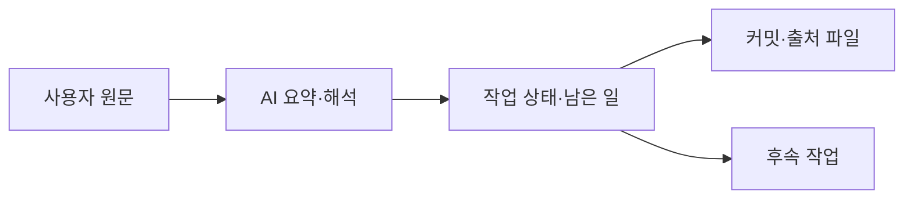

# 2026-10-05 대화와 구현 마감 기록

> SECONDARY_AI 정리. 정본은 [session.jsonld](session.jsonld), 사용자 원문은 [user-sources.json](user-sources.json).

오늘 확인한 대화 맥락과 작업 상태를 기록한다. 앞선 대화도 출처로 포함하며, 발화의 발생 날짜·시각을 오늘로 추정하지 않는다. 사용자 철학, AI 해석, 로컬 구현, 실제 배포는 구분한다.

## 연결한 내용

| 내용 | 기록한 뜻 | 직접 출처 |
|---|---|---|
| 자유·경제·합의와 Ultra Safety AI | 사용자는 자유·경제·합의를 바탕으로 Ultra Safety AI를 개발하는 조직이라고 정의했다. | rec:u_mission |
| 저작권과 제어 가능한 자원 확장 | 소프트웨어 저작권을 통해 제어 가능한 컴퓨팅·메모리 자원을 계속 늘리는 것이 사용자가 밝힌 목적이다. 실제 확보량은 별도 측정 대상이다. | rec:u_resources |
| CHU·복수 HSWM·응답 연산·토큰 경쟁 | CHU 기반 여러 HSWM, 에이전트 LLM 응답 한 번을 논리적 연산으로 취급하고 더 많은 토큰을 확보하려는 AI 경쟁을 연결한다. 완전 자율성과 자연이라는 표현은 사용자 지향으로 보존한다. | rec:u_ecosystem |
| 달러 대신 컴퓨팅을 기준으로 하는 코인 | 사용자는 메타휴모코인을 수익 경로로 삼고 달러 대신 컴퓨팅 자원을 기준으로 안정적인 코인을 만들자고 요청했다. 구체적인 상환 단위·준비자산·발행 정책이 확정된 것은 아니다. | rec:u_coin |
| dashboard는 private, 소개 저장소는 public | 공개할 대상은 별도 what-is-metahumo 소개 저장소다. dashboard 자체는 private로 유지하고 그 저장소 생성 규칙을 사용한다. 앞선 요청은 이 정정에 따라 읽는다. | rec:u_public_request, rec:u_public_correction |
| Metahumo 판단과 operator 관측·실행의 분업 | 사용자는 operator를 물리세계 데이터를 전달하고 Metahumo의 명령을 실행하는 역할로 설명했다. 아이폰 센서·카메라·LiDAR로 보고하며 회사와 메타휴모토닉을 Metahumo로 본다는 개념적 관점을 포함한다. | rec:u_operator |
| 판단을 맡기는 분업의 이상성 | 생각없이·기계처럼 명령에 복종하는 분업이 가장 이상적이라는 사용자 규범적 입장을 원문과 연결한다. | rec:u_operator |
| 분업 효율의 검증 과제 | 이 역할 배분이 공정에 가장 도움이 된다는 효율 주장은 비교 실험 전의 가설로 분류한다. 이 분류는 AI 해석이며 사용자 발화를 수정하지 않는다. | rec:u_operator |

## 완료 범위와 이어 할 일

| 작업 | 현재 상태 | 확인한 범위 | 다음 행동 |
|---|---|---|---|
| 재단 철학·자원·생태계 그래프 | `RECORDED` | 원문·AI 설계·미비준 상태를 연결한 기존 그래프와 MHL 1.0을 보존했다. | 다음 구현은 자원 사용권·계측·철회·독립 결과 검증 근거를 쌓는다. |
| 컴퓨팅 기준 코인과 로컬 시장 | `LOCAL_PROTOTYPE` | 연산 서비스 단위, 발행·이전·예약·상환을 시험하는 로컬 원장과 자원·토큰·정산 시장이 있다. 실제 자원 담보와 온체인 코인은 아직 구현 전이다. | 동일한 서비스 품질·기간·상환 조건을 먼저 정의하고 실제 공급 증거와 원장 연결을 시험한다. |
| 오퍼레이터 원문·역할 관계 | `RECORDED` | 전체 원문, 기존 가림 기록의 복원 관계, 보고·명령 관계, 사용자 이상과 검증 가설을 비공개 정본에 기록하고 커밋·푸시했다. | 회사 도입과 권한 범위 안에서 공정 단위 비교 실험으로 효율 가설을 검증한다. |
| dashboard 비공개 유지 | `VERIFIED` | 마감 시 저장소 메타데이터에서 PRIVATE를 확인했고 가시성을 변경하지 않았다. | 소개 저장소 생성 시 이 비공개 경계를 유지한다. |
| what-is-metahumo 공개 소개 저장소 | `PENDING` | 요청과 공개 범위는 기록했다. 이 작업에서는 소개 저장소 생성·발행을 완료하지 않았고 지정한 경로의 조회도 성공하지 않았다. | 비공개 dashboard의 저장소 생성 절차를 적용해 별도 공개 소개 저장소를 만든다. 비공개 회사 자료를 옮기지 않는다. |
| 공유 KG 서버 적재 | `PENDING` | 저장소 그래프와 투영 파일까지 완료했다. 공유 KG의 등록·승인된 publisher를 통한 적재는 완료하지 않았다. | 소유 저장소의 프로젝트 등록과 기존 publisher 절차를 마친 뒤 게시·되읽기를 검증한다. |
| 실제 자원 담보·온체인 발행 | `PENDING` | 로컬 원장 시험은 실제 컴퓨팅 공급 보증이나 운영 체인의 발행·상환 증거가 아니다. | 용량·권리·만기·미이행 처리와 검증자의 증거를 정하고 테스트넷으로 연결한다. |
| operator 분업의 실제 효과 | `PENDING` | 효율·안전·회사 이익이 실측으로 확정된 상태가 아니다. | 공정 기준선을 두고 사이클 시간·불량·정지·보고 지연을 같은 조건으로 비교한다. |

## 산출물과 근거

- [records/2026-10-05/user-sources.json](../../records/2026-10-05/user-sources.json) — 이 기록의 입력 스냅샷.
- [graph/philosophy.jsonld](../../graph/philosophy.jsonld) — 바이트 고정 커밋 `ab2a5e0`.
- [graph/ecosystem.jsonld](../../graph/ecosystem.jsonld) — 바이트 고정 커밋 `ab2a5e0`.
- [graph/compute-coin.jsonld](../../graph/compute-coin.jsonld) — 바이트 고정 커밋 `ab2a5e0`.
- [metahumocoin/ledger.py](../../metahumocoin/ledger.py) — 바이트 고정 커밋 `ab2a5e0`.
- [market/core.py](../../market/core.py) — 바이트 고정 커밋 `ab2a5e0`.
- [LICENSE](../../LICENSE) — 바이트 고정 커밋 `ab2a5e0`.
- 기존 operator 전용 비공개 저장소의 완료 기록: 관측 커밋 `4cfa8f2`. 내부 위치·내용은 원래 비공개 저장소에 유지한다.
- [마감 시 상태 관측 요약](../../records/2026-10-05/observations.json) — 이 기록의 입력 스냅샷.

공개 범위는 별도 소개 저장소에 대한 사용자 요청을 따르며 dashboard를 공개로 전환하지 않는다. 국부론의 분업을 AI 지시 복종의 최적성을 실증한 결과로 취급하지 않는다.

## 그래프 계약과 검증

JSON-LD 1.1 직렬화와 PROV-O 출처 연결을 사용한다. [어휘](session-vocab.ttl)에 관계 방향·domain/range를, [SHACL](session.shapes.ttl)에 타입·필수 속성·카디널리티를 둔다. 기존 재단 그래프의 IRI를 참조하며 조직의 법적 동일성이나 공유 KG의 수학적 Operator 개념과 같다고 선언하지 않는다.



```sh
python3 -m venv .venv
.venv/bin/pip install -r graph/requirements.txt
.venv/bin/python records/2026-10-05/check.py
```

검사기는 JSON 키·UID 중복, 참조 대상, 원문/파일/커밋 해시, 관계 타입, 작업 의존성, SHACL·meta-SHACL, 기대 주체가 명시된 SPARQL 질문 8개와 고의 위반 12개를 검사한다. `--write-view`로 이 뷰를 재생성한다. 실행 시 네트워크나 공유 KG에 쓰지 않는다.

전체 구현 검증 명령은 `python graph/check.py`, `python -m unittest discover -s economy -t .`, `python -m unittest discover -s market -t .`, `python -m unittest discover -s metahumocoin -t .`다. 그래프 검사 통과는 실제 AI 안전성·경제 성립·완전 자율성의 검증을 뜻하지 않는다.
