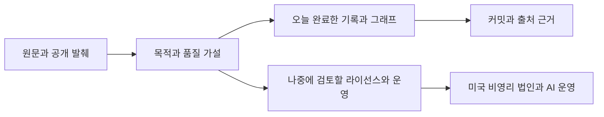

# 2026-10-10 작업 정리와 후속 검토

오늘 이 대화에서 진행한 입체운행구름 작업공간, 자원 기여 목적, 토큰당 지능 전제, 플라이휠과 연구 연결을 정리했다.
기술 연구는 입체운행구름에서 이어가고, 이 재단 저장소에서는 라이선스·실제 운영·미국 비영리 법인 검토를 후속 과제로 관리한다.

**동일 기본 LLM·동일 총토큰에서 HSWM·CHU가 더 유용한 답변을 만든다**는 것이 플라이휠의 첫 가설이다.
유용성 → 이용 수요 → 기여 → 공동 연산·기억 → 조직 개선 → 유용성의 순환을 설계했으며 실제 성능 우위는 미검증이다.

## 오늘 기록한 상태

| 작업 | 상태 | 완료 범위 또는 남은 일 |
|---|---|---|
| 입체운행구름 전용 작업공간 | VERIFIED | 비공개 저장소를 로컬 작업공간에 연결했다. |
| 자원 기여와 공동 지능 목적 기록 | RECORDED | 원문과 해석을 분리하고 자원·크레딧·MHC·HSWM·CHU의 관계를 기록했다. |
| 품질 전제와 조건부 플라이휠 | LOCAL_PROTOTYPE | 31개 노드·39개 관계·3개 순환·5개 질의와 검사 도구를 구축했다. 그래프 검사와 반례 시험 6개를 통과했다. 성능 실험 결과는 없다. |
| WHAT_IS와 HOW_TO 연구 연결 | VERIFIED | 두 기존 연구 기록이 COMPLETE이며 커밋·원문 해시·그래프·USL 연결을 확인했다. |
| 라이선스 기준선 재확인 | RECORDED | 현행 1.2와 미채택 1.3 초안을 유지한다. 44개 시험 통과는 2026-10-09의 기존 기록이며 오늘 재시험한 결과가 아니다. |
| HSWM CHU의 실제 토큰당 효용 | PENDING | 동일 모델·자료·총토큰 회계의 비교 설계까지 있으며 실제 모델 실험은 미실행이다. |
| 라이선스와 실제 운영 계약 검토 | PENDING | 사용자 요청에 따라 후속 검토로 남겼다. 이번 기록은 라이선스 개정이나 초안 채택이 아니다. |
| 미국 비영리 법인 설립과 운영 검토 | PENDING | 사용자가 나중에 검토할 의제로 지정했다. 법인 설립·관할 선택·신청 절차를 실행하지 않았다. |
| AI 중심 재단 운영 설계 | PENDING | AI를 중심으로 운영하려는 방향을 기록했다. 법적 책임과 기술적 실행 권한 배분은 미정이다. |
| 실제 서비스와 MHC 실행 | PENDING | 라이선스 문서와 설계 그래프만으로 실제 자원 공유·서비스 보장·MHC 발행이 완료되지 않는다. |

## 재단에서 나중에 검토할 질문

- 라이선스와 실제 기여·접근·서비스 계약을 어떻게 연결할 것인가?
- 미국 비영리 법인의 목적·조직 형태·관할·설립 절차와 지속 운영 의무는 무엇인가?
- AI 중심 운영에서 법적 책임 주체와 기술적 의사결정·실행 권한은 어떻게 배분할 것인가?
- 계약·회계·지출·기록 보존·오류 정정·복구를 어떤 운영 절차로 묶을 것인가?

이 질문들은 후속 조사 목록이다. 법률·세무 검토 결과나 설립 관할 추천, 실제 법인 설립·운영 개시를 기록한 것이 아니다.
개인 재무 구상과 전체 최신 발화는 비공개 기록에 유지한다. 공개 기록의 발췌는 원문 전체와 구별한다.

## 출처와 검증

정본은 [session.jsonld](session.jsonld), 공개 가능한 사용자 발화와 발췌는 [user-sources.json](user-sources.json)이다.
요약은 SECONDARY_AI이며 원문과 분리한다. 비공개 산출물은 관측 커밋만 참조하고 내부 위치·본문을 복제하지 않는다.
JSON-LD와 PROV-O로 출처를 연결하며, 기존 [일일 기록 어휘](../2026-10-05/session-vocab.ttl)와
[SHACL 계약](../2026-10-05/session.shapes.ttl)을 재사용한다. SHACL의 기록 namespace만 오늘의 namespace로 대입한다.



```sh
.venv/bin/python records/2026-10-10/check.py
```

검사는 원문·고정 커밋 해시, 관계 끝점·타입·기수, 의존 순환, SHACL·meta-SHACL, SPARQL 질문 7개와 고의 위반 10개를 다룬다.
그래프 무결성 검사는 법적 유효성·AI 성능·안전성의 검증과 구분한다. 현행 라이선스 1.2와 미채택 1.3 초안은 그대로 유지한다.
